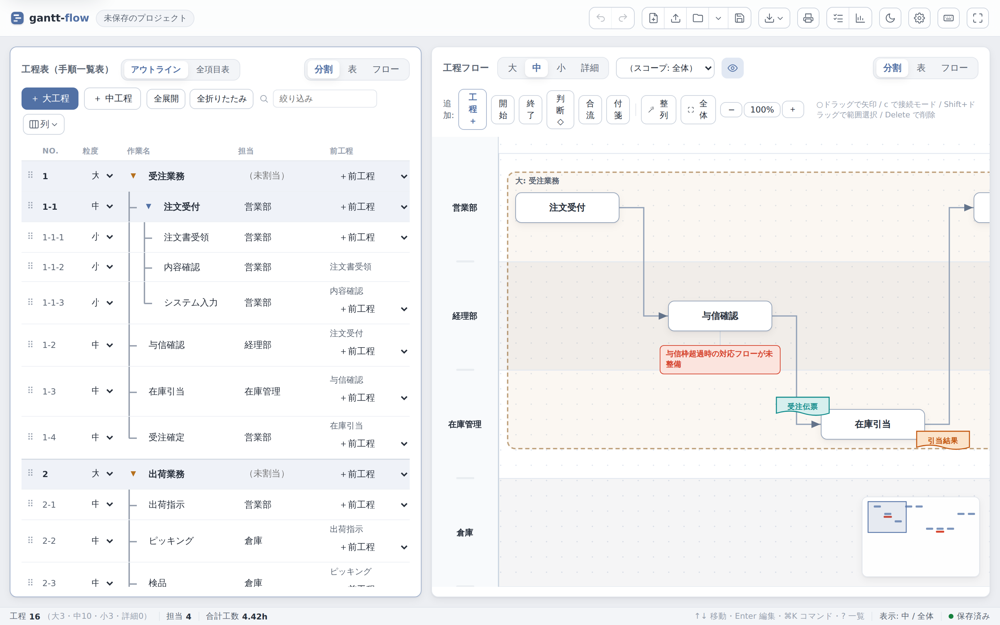
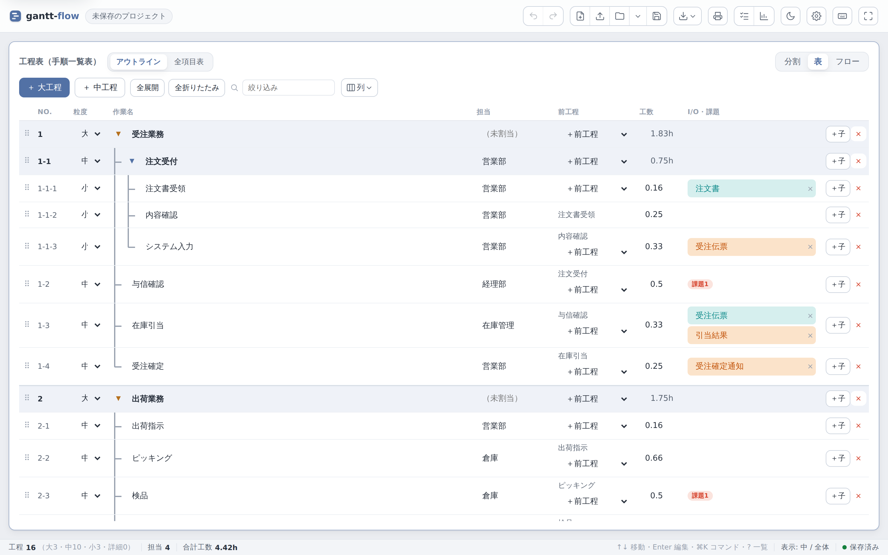
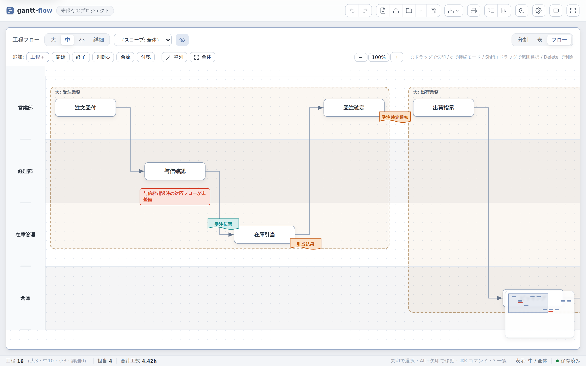
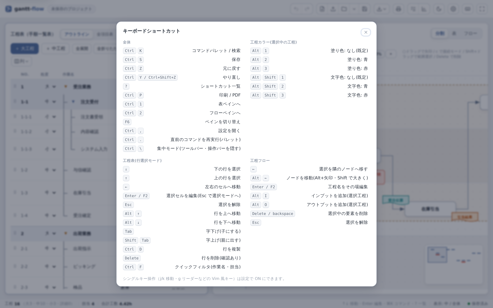
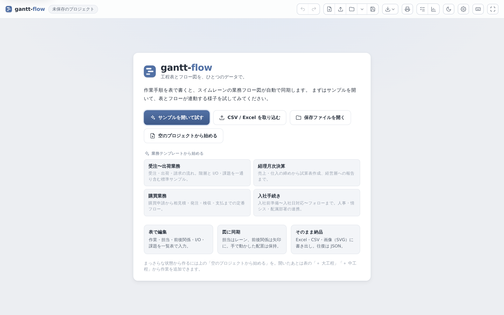

# gantt-flow

業務ヒアリングの成果物を **手順一覧表（工程表）** と **スイムレーン業務フロー図（工程フロー）**
の 2 形態で作成し、**両者を同期** させるデスクトップアプリ。
工程表を編集すると、対応する工程フローが自動的に更新されるのが目玉機能。

- 機密データは社内共有フォルダにファイルとして保存（オフライン・ローカルファイル中心・クラウド非依存）。
- 工程は **大 > 中 > 小 > 詳細** の階層（4 階層は型・深さは可変）で扱い、フローはどの粒度でも閲覧でき、
  親範囲（大/中工程）を帯で可視化する。
- **キーボード中心**で操作でき（Vim 風の単キー＋`g` リーダー）、`?` でショートカット一覧を表示。

> 技術スタックは Tauri 2 + React + TypeScript。現在は **設計書 + ドメイン層（`packages/core`）+ Web UI（`apps/desktop`）+ Tauri 殻（Rust コマンド＋フロント配線）** まで実装済み。
> **ブラウザで起動して「表を編集 → フロー自動同期」をそのまま体験できます**（デスクトップ実機バイナリのビルド/実行のみ各自環境で）。



## 主な機能

### 表とフローを 1 つのデータで同期

工程表（左）で作業・担当・前後関係・I/O・課題を入力すると、スイムレーン業務フロー図（右）が自動で同期します。
担当は **レーン**、前後関係は **矢印** になり、手で動かしたノードの配置は編集を跨いで保持されます。

| 工程表（全項目表） | 業務フロー図（全幅） |
|---|---|
|  |  |

- **粒度切替（大/中/小/詳細）**：`g 1〜4` でレベルを切り替え、どの粒度でもフローを閲覧。
- **親範囲バンド**：表示粒度の祖先（中/大工程）を横帯で可視化し、入れ子で表示。
- **逆同期**：ノードを別レーンへドラッグすると担当が表に書き戻る。
- **接続・制御フロー**：接続モード（`c`）で依存を引き、開始/終了/判断/合流などの制御ノードや付箋も配置可能。
- **I/O・課題レイヤ**：帳票・情報の I/O や課題ノートを表示/非表示で切り替え。
- **自動整列・ミニマップ・ズーム**：依存グラフに基づく自動整列、右下ミニマップ、`+`/`-`/`0`/`f` でズーム・フィット。
- **双方向追従**：表⇄フローで選択した対象が、もう一方でも画面内へスクロールして追従。

### 3 つのレイアウト ＋ 集中モード

上部の `分割｜表｜フロー` セグメントで表示を切替。`g d`（分割）/ `g t`・`g f`（各ペインをアクティブ化）/ `g T`・`g F`（全画面トグル）でキーボードからも操作できます。
`Ctrl/⌘+\` の **集中モード** はツールバーと各ビューの操作バーを隠し、作業エリアを最大化します。
工程表は **アウトライン**（階層を強調）と **全項目表**（フラット・全列表示）を `V` で切替。

### キーボードファースト

`?` でショートカット一覧（ダークテーマにも対応）。



| 区分 | 代表的なキー |
|---|---|
| 全体 | `Ctrl/⌘+K` コマンドパレット・検索／`Ctrl/⌘+S` 保存／`Ctrl/⌘+Z`・`Ctrl/⌘+Y` 取消・やり直し／`Ctrl/⌘+P` 印刷・PDF／`Ctrl/⌘+\` 集中モード／`?` ヘルプ |
| 移動 | `g t`・`g f`・`g d` レイアウト切替／`g T`・`g F` 全画面／`g 1〜4` 粒度／`g i` 課題一覧／`g s` サマリ |
| 工程表 | `j/k`・`↑/↓` 行移動／`h/l`・`←/→` セル移動／`Enter`・`F2` 編集／`N`・`Shift+N` 工程追加／`Tab`・`Shift+Tab` 字下げ・字上げ／`Alt+↑/↓` 行移動 |
| フロー | `←↑→↓`・`hjkl` ノード選択／`Alt+矢印` ノード移動／`c` 接続モード／`n` 次工程を追加して接続／`i`・`o` I/O 追加 |

> 修飾なしの単キー操作（Vim 風）は誤爆防止のため既定 OFF。設定（`Ctrl/⌘+,`）から ON にできます。
> 矢印・`Ctrl/⌘`・`Enter`・`Esc`・`Delete` などの慣習キーは常時有効です。

### 入出力・保存

- **保存 / 開く**：ブラウザは File System Access API（同一ファイルへ上書き）、Tauri はアトミック保存＋助言ロックで同時編集に対応。最近使ったファイルの再オープンも可。
- **取り込み**：CSV / Excel を取り込んで新規プロジェクト化。工程No による前工程参照でラウンドトリップ。
- **出力**：Excel（.xlsx）／CSV（数式インジェクション対策あり）／画像（SVG・PNG）／印刷・PDF（工程表＋フローを 1 枚に合成）。
- **自動退避 / 世代バックアップ**：未保存データを localStorage に自動退避し起動時に復元確認。保存成功時は直近世代をバックアップ。
- **設定の共有**：テーマ・単キー操作・キーバインド・列設定を JSON で書き出し／読み込み（別 PC・チーム共有用）。

## 現在の状態

| レイヤ | 状態 |
|---|---|
| 設計書（`docs/`） | ✅ 完了（仕様・決定事項・UIワイヤー） |
| `packages/core`（モデル・コマンド・同期`reconcile`・永続化・履歴） | ✅ 実装（Vitest 140 件 green） |
| `apps/desktop`（React UI: 工程表＋フロー＋レイアウト切替＋集中モード＋キーボード操作＋保存/取込/出力） | ✅ Web 版が起動可（Vitest 222 件 green） |
| 粒度切替・親範囲バンド・課題レイヤ・逆同期(レーン→担当)・取り込み(CSV/Excel) | ✅ 実装 |
| 自動退避・世代バックアップ・設定の JSON 共有・テーマ（ライト/ダーク） | ✅ 実装 |
| `crates/fsstore`（Rust: アトミック保存＋助言ロック=同時編集の核） | ✅ 実装（cargo test 15 件 green） |
| `apps/desktop/src-tauri`（Tauri 2 殻: save/open・stat・助言ロック・ファイルダイアログ・パス許可リスト） | ✅ Rust コマンド実装＋フロント配線済（`persistence.ts` が `__TAURI__` 検出で invoke） |
| 出力(Excel・CSV・SVG/PNG・印刷/PDF) | ✅ 実装 |
| デスクトップ実機ビルド/実行（`libwebkit2gtk-4.1-dev`＋画面が必要・[手順](apps/desktop/src-tauri/README.md)） / E2E(Playwright) | ⛔ 本リポジトリでは未実施 |

## はじめかた（クローン → 起動）

前提: **Node.js 22+**（`node -v` で確認）／ npm 10+。

```bash
# 1. クローン
git clone https://github.com/mmmsmm16/gantt-flow.git
cd gantt-flow

# 2. 依存をインストール（npm workspaces）
npm install

# 3. アプリを起動（ブラウザで http://localhost:5173 が開く）
npm run dev -w @gantt-flow/desktop
```

起動するとウェルカム画面が開きます。**「サンプルを開いて試す」** から、表とフローが連動する様子をすぐに確認できます。



サンプルや業務テンプレートを開いたら、表で担当・前工程・I/O・課題を編集すると、右の **業務フロー図が自動で同期** されます。
フローのノードはドラッグで動かせ、配置は編集を跨いで保持されます（戻す/やり直しも可）。
**粒度切替・親範囲バンド・課題レイヤ ON/OFF・別レーンへドラッグで担当を書き戻す逆同期**にも対応。
**「保存」で `.json` 書き出し、「開く」で読込、「取り込み(CSV/Excel)」で既存表から新規作成**できます。

### 開発（テスト・型チェック・ビルド）

```bash
npm test            # TS 全ワークスペースのテスト（core 140 + desktop 222）
npm run typecheck   # 型チェック
npm run build -w @gantt-flow/desktop          # 本番ビルド
cargo test --manifest-path crates/fsstore/Cargo.toml   # Rust（保存/ロック層・15 件）
```

`packages/core` 単体で作業する場合は `cd packages/core && npm run test:watch`。

> **Tauri デスクトップ殻のコードは実装済みです（このリポジトリでは実機バイナリをビルドしていません）。**
> デスクトップ保存の核（アトミック書き込み・助言ロック）は `crates/fsstore` に Rust で実装＆テスト済み、
> それを呼ぶ Tauri コマンド（`apps/desktop/src-tauri/src/main.rs`）と、`__TAURI__` を検出して invoke する
> フロント側（`apps/desktop/src/persistence.ts`）も配線済みです。残るのは実機バイナリのビルド/実行で、
> `libwebkit2gtk-4.1-dev` 等と画面が要るため各自の環境で行います。手順は
> [apps/desktop/src-tauri/README.md](apps/desktop/src-tauri/README.md) を参照。

### UI ワイヤーフレーム（参考）

`docs/wireframes/` に画面イメージ（PNG）があります。再生成する場合は Python + cairosvg + 日本語フォント(IPAGothic 等)が必要:

```bash
cd docs/wireframes && python3 build.py
```

## リポジトリ構成

```
gantt-flow/
├── docs/                 # 設計書（00〜08）＋ wireframes/ ＋ screenshots/
├── packages/
│   └── core/             # 純粋TSドメイン層（UI非依存・Vitest）
│       ├── src/          # model / commands / sync(reconcile) / persistence / history / import / export / metrics / templates
│       └── test/
├── apps/
│   └── desktop/          # React UI（Vite）。store は core を薄く包む
│       ├── src/          # App / TableView / FullTable / FlowCanvas / store / persistence / autosave / backups / settings / keymap
│       ├── src-tauri/    # Tauri 2 殻（Rust commands → fsstore）。ビルドは各自環境
│       └── test/
├── crates/
│   └── fsstore/          # Rust: アトミック保存＋助言ロック（Tauri 殻が呼ぶ／cargo test）
├── package.json          # npm workspaces ルート
└── README.md
```

## 設計ドキュメント

| ドキュメント | 内容 |
|---|---|
| [docs/00-overview.md](docs/00-overview.md) | 目的・対象ユーザー・ユースケース・用語定義 |
| [docs/01-architecture.md](docs/01-architecture.md) | 技術スタック・モジュール構成・全体像 |
| [docs/02-data-model.md](docs/02-data-model.md) | データモデル（階層ツリー＋3層分離） |
| [docs/03-view-spec.md](docs/03-view-spec.md) | 工程表ビュー／フロービュー仕様 |
| [docs/04-sync-spec.md](docs/04-sync-spec.md) | 同期（reconcile）仕様・アルゴリズム |
| [docs/05-persistence.md](docs/05-persistence.md) | ファイル形式・保存・共有フォルダ運用 |
| [docs/06-roadmap.md](docs/06-roadmap.md) | MVP 段階分け |
| [docs/07-open-questions.md](docs/07-open-questions.md) | 後で整合する未確定事項 |
| [docs/08-testing.md](docs/08-testing.md) | テスト戦略 |
</content>
